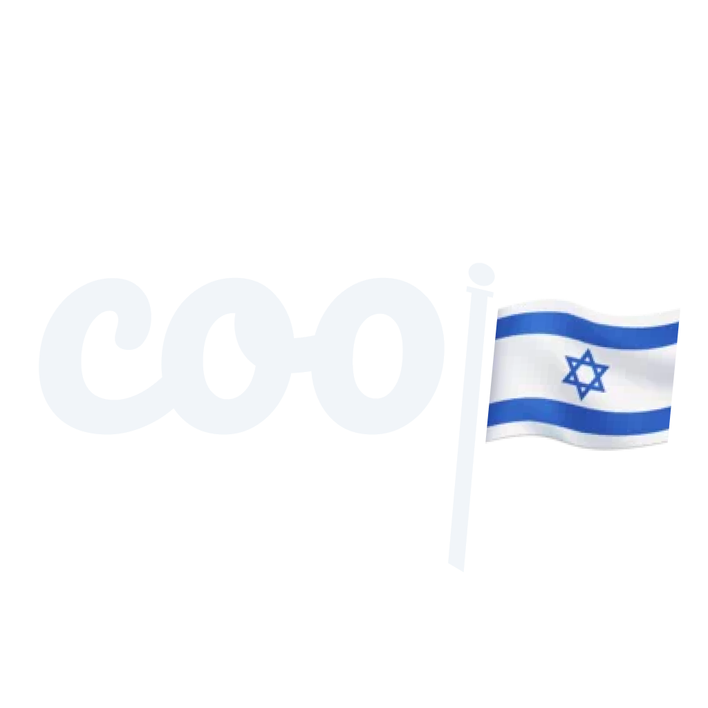

<!-- PROJECT SHIELDS -->
<!--
*** I'm using markdown "reference style" links for readability.
*** Reference links are enclosed in brackets [ ] instead of parentheses ( ).
*** See the bottom of this document for the declaration of the reference variables
*** for contributors-url, forks-url, etc. This is an optional, concise syntax you may use.
*** https://www.markdownguide.org/basic-syntax/#reference-style-links
-->

# CooP - Protest Map 🇮🇱

 

<a href="https://github.com/stavgafny/coop">
<picture>
  <source media="(prefers-color-scheme: dark)" srcset="./assets/images/RMlogo.png">
  
</picture>
</a>
  

    <a href="https://github.com/stavgafny/coop/issues">Report Bug</a>
    ·
    <a href="https://github.com/stavgafny/coop/issues">Request Feature</a>
  

<!-- TABLE OF CONTENTS -->

  
Table of Contents

  <ol>
    <li>
      <a href="#overview">About The Project</a>
    </li>
    <li><a href="#getting-started">Getting started</a></li>
    <li>
      <a href="#key-Features">Key Features</a>
    </li>
    <li><a href="#license">License</a></li>
    <li><a href="#contact">Contact</a></li>
     <li><a href="#disclaimer">Disclaimer</a></li>
  </ol>

<!-- ABOUT THE PROJECT -->

## Overview

CooP is an open-source application that empowers users with the ability to access a map of protests in 🇮🇱 while ensuring complete anonymity and data privacy. It utilizes discreet and authentication-less methods to deliver accurate and reliable results to users.

## Getting Started

**TBA**

## Key Features

- **Anonymous Location Scanning**: CooP scans users' locations without exposing their personal data, ensuring complete privacy and confidentiality.

- **Auth-Less Access**: Users can access the protest map without the need for authentication or sign-in, making it a seamless and hassle-free experience.

- **Accurate and Efficient**: CooP delivers great results, providing real-time information about protests in 🇮🇱, ensuring users stay informed and updated.

- **Protest Search**: Users can easily search for specific protests or events, making it convenient to find and join the nearest ones.

## License 

CooP is open-source software licensed under the [MIT License](https://opensource.org/licenses/MIT). Feel free to use, modify, and distribute it in accordance with the terms of the license.

## Contact

[Stav Gafny](https://www.linkedin.com/in/stav-gafny/)

[Itai Mizlish](https://www.linkedin.com/in/itai-mizlish/)

## Disclaimer

CooP is designed to respect user privacy and anonymity. However, users are advised to exercise caution and follow local laws and guidelines while using the application. The developers of CooP shall not be held responsible for any misuse or illegal activities conducted by its users.
